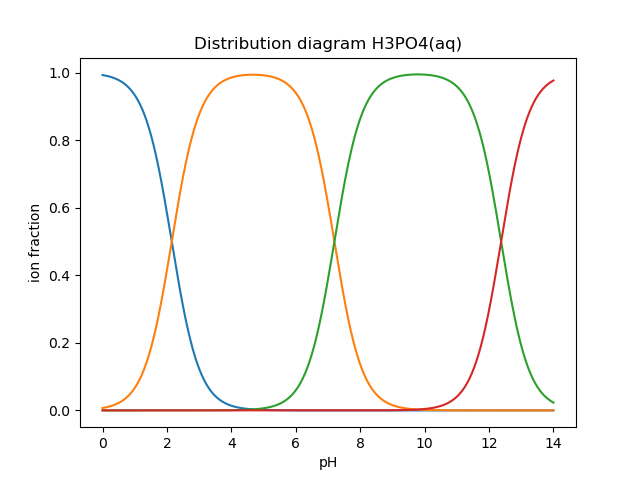
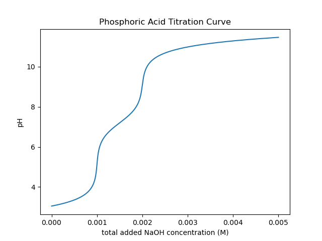

# pHcalc (a fork)

This is a forked version of *pHcalc* adapted for use in our lab. The original can be found at <https://github.com/rnelsonchem/pHcalc>

*pHcalc* is a Python (Python 3.8 or later) library for systematic calculations of aqueous solution pH, distribution diagrams, and titration curves, using the simple law of mass action.

Its only [dependencies](#dependencies) are Numpy and Scipy. If you will be plotting the data, then there is an [optional
dependency](#optional packages) on Matplotlib as well. For running the comparison between *pHcalc* and *PHREEQC*, `phreeqpython` is needed.

All property data (Ka's or pKa's, Kw, etc.) should be provided by the user (who should look them up in reliable literature references). *pHcalc* is not a database, it only solves the coupled mass-action equilibrium equations with the parameters (chemical property data) given by the user. The calculations considers 'effective' equilibrium constants, and ignores any changes in activity coefficients.

# Installation and development

## TO DO

-   Add documentation for `AcidGasEq` to this README, and clean up.

## Dependencies

-   Numpy \>= 1.20
-   Scipy \>= 1.10

## Optional Packages

-   Matplotlib \>= 1.5
-   `phreeqpython`: <https://github.com/Vitens/phreeqpython>

## Installation

*pHcalc* is 'pure scientific Python' (only dependencies are numpy, scipy, matplotlib).

With `pip`, you can install the current version from the [GitHub repository](https://github.com/mhvwerts/pHcalc):

    $ pip install git+https://github.com/mhvwerts/pHcalc.git

Alternatively, the folder `src\pHcalc` may simply be copied to your Python project folder, making the module available for import to scripts in the project folder.

## Development environment

For development, clone the repository to a local directory:

    $ git clone git@github.com:mhvwerts/pHcalc.git

or unpack the ZIP downloaded from GitHub.

A suitable development and test Python environment can be created with conda:

    $ conda create --name phcalc_dev python numpy scipy matplotlib spyder jupyterlab
    $ conda activate phcalc_dev

Once the environment configured and activated, you can change your working directory to the local copy of the pHcalc repository and install an editable (development) version:

    $ pip install --editable .

(Do not forget the trailing dot!)

## Testing

*pHcalc* is a small module with a small testing infrastructure, which does not use any specific testing library. All features are tested and illustrated (or should be). To test *pHcalc*, simply launch the following from within the root directory of the local project git repository.

	$ python ./test_demo.py

Testing is most complete with `matplotlib` installed (which is usually the case). When launching the test script from the command line, the graph windows that appear should be closed one by one to continue to the next step of the test.

# Background

*pHcalc* calculates the pH of a complex system of acids and bases using a systematic equilibrium solution method. This method is described in detail in [the Journal of Chemical Education](http://pubs.acs.org/doi/abs/10.1021/ed100784v) and in this [ChemWiki article](http://chemwiki.ucdavis.edu/Core/Analytical_Chemistry/Analytical_Chemistry_2.0/06_Equilibrium_Chemistry/6G%3A_Solving_Equilibrium_Problems#6G.3_A_Systematic_Approach_to_Solving_Equilibrium_Problems), for example. (There was also another, older Pascal program called [PHCALC](http://pubs.acs.org/doi/pdf/10.1021/ed071p119), which uses matrix algebra to accomplish the same task. To the best of our knowledge, the source code for this program is no longer available.)

Basically, this method finds the equilibrium concentrations for the solution by systematically adjusting the pH until a charge balance is achieved, *i.e.* the concentrations of positively charged ions equals the charge for the negatively charged ions. For (polyprotic) weak acids, the fractional distribution of the species at a given pH value is determined. Multiplying this by the concentration of acid in solution provides the concentration of each species in the system, and these concentrations are used to balance the charge.

# Defined Classes

*pHcalc* defines three classes - AcidAq, IonAq, and System - which are used in calculating the pH of the system. H<sub>3</sub>O<sup>+</sup> and OH<sup>-</sup> are never explicitly defined; these concentrations are adjusted internally using K<sub>W</sub>.

``` python
>>> from pHcalc import AcidAq, IonAq, System
```

The general definitions of these objects are given in the following list, with detailed usage examples outlined in the [examples](#examples) section below.

-   `AcidAq` This class is used to define an aqueous species that has   one or more known K<sub>a</sub>/pK<sub>a</sub> values.
-   `IonAq` This class is used to define aqueous ions that are assumed to not be part of any aqueous equilibria. For example, Na<sup>+</sup> or Cl<sup>-</sup>.
-   `System` This is a collection of `AcidAq` and `IonAq` objects that define your aqueous solution. This class has a method for calculating the pH of this group of species.

# Example Usage

The examples below are meant to demonstrate a variety of different usage cases of the *pHcalc* classes described above. These example can be run from an interactive terminal (including Jupyter notebooks) or from a '.py' file. However, the following imports are assumed in every case.

``` python
>>> from pHcalc import AcidAq, IonAq, System
>>> import numpy as np
>>> import matplotlib.pyplot as plt # Optional for plotting below
```

## pH of 0.01 M HCl

This simple example can be calculated in two different ways using *pHcalc*, which highlights the usage of all the defined object classes.

### Method 1

In the first method, the `AcidAq` class is used to define our acid HCl, as shown in the code snippet below.

``` python
>>> hcl = AcidAq(pKa=-8., charge=0, conc=0.01, name='HCl')
```

For HCl, the given pK<sub>a</sub> is an [estimate](https://organicchemistrydata.org/hansreich/resources/pka/pka_data/evans_pKa_table.pdf), but it will work fine for our purposes. The `charge` keyword is an integer used to define the charge for the most acidic species. For HCl, the two possible species in solution are HCl and Cl<sup>-</sup> -- the most acidic species, HCl, does not have a charge. The `conc` keyword argument sets the total molarity (\[Total\] = \[HCl\] + \[Cl<sup>-</sup>\]) of this acid in solution. The final (optional) keyword argument, `name`, is a string that can be used to set the name of this `AcidAq` for printing purposes, as discussed below.

The `System` class is used to collect a group of `AcidAq` and `IonAq` species for pH calculations. Any number of species instances can be passed in as positional arguments during initialization. Printing this instance provides some information about the species in solution. Notice that a warning is give that lets us know the solution is not at equilibrium -- i.e. the pH has not been calculated. A very important aspect of the code is that H<sub>3</sub>O<sup>+</sup> and OH<sup>-</sup> concentrations are not defined explicitly.

``` python
>>> system = System(hcl)
>>> print(system)
```

    ### THE CONCENTRATIONS OF THIS SYSTEM ARE NOT AT EQUILIBRIUM ###
    To determine the equilibrium species distribution use System.pHsolve

    Species        Charge    Ka             pKa       Conc
    =================================================================
    HCl            +0        1.000e+08      -8.00     1.0000e-02
    HCl            -1        nan            nan       0.0000e+00
    -----------------------------------------------------------------
    H3O+           +1                                 1.0000e-07
    OH-            -1                                 1.0000e-07

The `pHsolve` method can be used to calculate the equilibrium concentrations, including pH. Printing the `System` instance again will now show the pH and equilibrium concentrations.

``` python
>>> system.pHsolve()
>>> print(system)
```

    ### THESE ARE THE EQUILIBRIUM SYSTEM CONCENTRATIONS ###

    SYSTEM pH: 2.000

    Species        Charge    Ka             pKa       Conc
    =================================================================
    HCl            +0        1.000e+08      -8.00     1.0000e-10
    HCl            -1        nan            nan       1.0000e+00
    -----------------------------------------------------------------
    H3O+           +1                                 1.0000e-02
    OH-            -1                                 9.9999e-13

After running the `pHsolve` method, a new object attribute, `pH`, is created, which is the calculated pH value with full precision.

``` python
>>> print(system.pH)
1.9999977111816385
```

### Method 2

An alternate method for determining the pH is to define a solution of chloride (Cl<sup>-</sup>) ions. HCl is typically considered a strong acid in aqueous solutions, because it is assumed that this molecule completely dissociates to equal amounts of H<sub>3</sub>O<sup>+</sup> and Cl<sup>-</sup>. Because *pHcalc* calculates the H<sub>3</sub>O<sup>+</sup> concentration internally, this species does not need to be included in the `System` call. Instead, we can define Cl<sup>-</sup> as an instance of the `IonAq` object class. These objects are used to define aqueous ions that are assumed to not directly participate in Bronsted-Lowry acid/base equilibria; however, their presence in solution affects the overall charge balance of the solution. Printing this system before equilibration shows an equal concentration of "Chloride" and "H<sub>3</sub>O<sup>+</sup>" (1.000e-02).

``` python
>>> cl = IonAq(charge=-1, conc=0.01, name='Chloride')
>>> system = System(cl)
>>> print(system)
```

    ### THE CONCENTRATIONS OF THIS SYSTEM ARE NOT AT EQUILIBRIUM ###
    To determine the equilibrium species distribution use System.pHsolve

    Species        Charge    Ka             pKa       Conc
    =================================================================
    Chloride       -1                                 1.0000e-02
    -----------------------------------------------------------------
    H3O+           +1                                 1.0000e-02
    OH-            -1                                 1.0000e-12 

Equilibrating this system with the `pHsolve` method provides a solution with the same pH value as our original solution using HCl.

``` python
>>> system.pHsolve()
>>> print(system)
```

    ### THESE ARE THE EQUILIBRIUM SYSTEM CONCENTRATIONS ###

    SYSTEM pH: 2.000

    Species        Charge    Ka             pKa       Conc
    =================================================================
    Chloride       -1                                 1.0000e-02
    -----------------------------------------------------------------
    H3O+           +1                                 1.0000e-02
    OH-            -1                                 9.9999e-13

## pH of 1e-8 M HCl

This is a notoriously tricky example for introductory chemistry students, since the autoprotolysis of water needs to be taken into account explicitly. *pHcalc* handles it nicely.

``` python
>>> cl = IonAq(charge=-1, conc=1e-8)
>>> system = System(cl)
>>> system.pHsolve()
>>> print(system) # pH is 6.978 NOT 8!
```

    ### THESE ARE THE EQUILIBRIUM SYSTEM CONCENTRATIONS ###

    SYSTEM pH: 6.978

    Species        Charge    Ka             pKa       Conc
    =================================================================
    Chloride       -1                                 1.0000e-08
    -----------------------------------------------------------------
    H3O+           +1                                 1.0512e-07
    OH-            -1                                 9.5125e-08

## pH of 0.01 M NaOH

This example is very similar to our second HCl example, except that our IonAq species must have a positive charge. In the same manner as our HCl examples above, the charge balance is achieved internally by the system using an equivalent amount of OH<sup>-</sup>.

``` python
>>> na = IonAq(charge=1, conc=0.01)
>>> system = System(na)
>>> system.pHsolve()
>>> print(system.pH) # Should print 12.00000
```

## pH of 0.01 M HF

Here we will use an AcidAq object instance to define the weak acid HF, which has a K<sub>a</sub> of 6.76e-4 and a pK<sub>a</sub> of 3.17. You can use either value when you create the AcidAq instance. When defining an AcidAq species, you must always define a `charge` keyword argument, which is the charge of the *fully protonated species*.

``` python
>>> hf = AcidAq(Ka=6.76e-4, charge=0, conc=0.01)
>>> # hf = AcidAq(pKa=3.17, charge=0, conc=0.01) will also work
>>> system = System(hf)
>>> system.pHsolve()
>>> print(system.pH) # Should print 2.6413261
```

## pH of 0.01 M NaF

This system consist of a 1:1 mixture of an HF AcidAq instance and a Na<sup>+</sup> IonAq instance. The System object can be instantiated with an arbitrary number of AcidAq and IonAq objects. Again, there is an implied equivalent of OH<sup>-</sup> necessary to balance the charge of the system.

``` python
>>> hf = AcidAq(Ka=6.76e-4, charge=0, conc=0.01)
>>> na = IonAq(charge=1, conc=0.01)
>>> system = System(hf, na)
>>> system.pHsolve()
>>> print(system.pH) # Should print 7.5992233
```

## pH of 0.01 M H<sub>2</sub>CO<sub>3</sub>

The K<sub>a</sub> and pK<sub>a</sub> attributes also accept lists of values for polyprotic species.

``` python
>>> carbonic = AcidAq(pKa=[6.35, 10.33], charge=0, conc=0.01)
>>> system = System(carbonic)
>>> system.pHsolve()
>>> print(system.pH) # Should print 4.176448
```

## pH of 0.01 M Alanine Zwitterion Form

Alanine has two pKa values, 2.35 and 9.69, and the fully protonated form is positively charged. In order to define the neutral zwitterion, a `System` containing only the positively charged `AcidAq` object needs to be defined. The charge balance in this case implies a single equivalent of OH<sup>-</sup>, as can be seen by printing the `System` instance before calculating the pH.

``` python
>>> ala = AcidAq(pKa=[2.35, 9.69], charge=1, conc=0.01)
>>> system = System(ala)
>>> print(system)
```

    ### THE CONCENTRATIONS OF THIS SYSTEM ARE NOT AT EQUILIBRIUM ###
    To determine the equilibrium species distribution use System.pHsolve

    Species        Charge    Ka             pKa       Conc
    =================================================================
    Acid1          +1        4.467e-03      2.35      1.0000e-02
    Acid1          +0        2.042e-10      9.69      0.0000e+00
    Acid1          -1        nan            nan       0.0000e+00
    -----------------------------------------------------------------
    H3O+           +1                                 1.0000e-12
    OH-            -1                                 1.0000e-02

``` python
>>> system.pHsolve()
>>> print(system)
```

    ### THESE ARE THE EQUILIBRIUM SYSTEM CONCENTRATIONS ###

    SYSTEM pH: 6.099

    Species        Charge    Ka             pKa       Conc
    =================================================================
    Acid1          +1        4.467e-03      2.35      1.7810e-04
    Acid1          +0        2.042e-10      9.69      9.9957e-01
    Acid1          -1        nan            nan       2.5643e-04
    -----------------------------------------------------------------
    H3O+           +1                                 7.9587e-07
    OH-            -1                                 1.2565e-08

In practice, though, a solution of this species would be created by dissolving the commercially available HCl salt of alanine (Ala\*HCl) in water and adding an equimolar amount of NaOH to free the base. This situation can be easily accomplished by adding `IonAq` instances for Cl<sup>-</sup> and Na<sup>+</sup>; the result of this pH calculation is equivalent to before. (Note: the ionic strength of this solution will be quite a bit different, though.)

``` python
>>> ala = AcidAq(pKa=[2.35, 9.69], charge=1, conc=0.01)
>>> cl = IonAq(charge=-1, conc=0.01, name='Chloride')
>>> na = IonAq(charge=1, conc=0.01, name='Sodium')
>>> system = System(ala, cl, na)
>>> system.pHsolve()
>>> print(system)
```

    ### THESE ARE THE EQUILIBRIUM SYSTEM CONCENTRATIONS ###

    SYSTEM pH: 6.099

    Species        Charge    Ka             pKa       Conc
    =================================================================
    Acid1          +1        4.467e-03      2.35      1.7810e-04
    Acid1          +0        2.042e-10      9.69      9.9957e-01
    Acid1          -1        nan            nan       2.5643e-04
    -----------------------------------------------------------------
    Chloride       -1                                 1.0000e-02
    -----------------------------------------------------------------
    Sodium         +1                                 1.0000e-02
    -----------------------------------------------------------------
    H3O+           +1                                 7.9587e-07
    OH-            -1                                 1.2565e-08

## pH of 0.01 M (NH<sub>4</sub>)<sub>3</sub>PO<sub>4</sub>

This is equivalent to a 1:3 mixture of H<sub>3</sub>PO<sub>4</sub> and NH<sub>4</sub><sup>+</sup>, both of which are defined by AcidAq objects. Three equivalents of OH<sup>-</sup> are implied to balance the charge of
the system.

``` python
>>> phos = AcidAq(pKa=[2.148, 7.198, 12.319], charge=0, conc=0.01)
>>> nh4 = AcidAq(pKa=9.25, charge=1, conc=0.01*3)
>>> system = System(phos, nh4)
>>> system.pHsolve()
>>> print(system.pH) # Should print 8.95915298
```

## Distribution Diagrams

AcidAq objects also define a function called `alpha`, which calculates the fractional distribution of species at a given pH. This function can be used to create distribution diagrams for weak acid species. `alpha`
takes a single argument, which is a single pH value or a Numpy array of values. For a single pH value, the function returns a Numpy array of fractional distributions ordered from most acid to least acidic species.

``` python
>>> phos = AcidAq(pKa=[2.148, 7.198, 12.319], charge=0, conc=0.01)
>>> phos.alpha(7.0)
array([ 8.6055e-06, 6.1204e-01, 3.8795e-01, 1.8611e-06])
>>> # This is H3PO4, H2PO4-, HPO4_2-, and PO4_3-
```

For a Numpy array of pH values, a 2D array of fractional distribution values is returned, where each row is a series of distributions for each given pH. The 2D returned array can be used to plot a distribution diagram.

``` python
>>> phos = AcidAq(pKa=[2.148, 7.198, 12.319], charge=0, conc=0.01)
>>> phs = np.linspace(0, 14, 1000)
>>> fracs = phos.alpha(phs)
>>> plt.plot(phs, fracs)
>>> plt.legend(['H3PO4', 'H2PO4^1-', 'HPO4^2-', 'PO4^3-'])
>>> plt.show()
```



## Titration Curves

Using a simple loop, we can also construct arbitrary titration curves as well. In this example, we will titrate H<sub>3</sub>PO<sub>4</sub> with NaOH.

``` python
>>> na_moles = np.linspace(1e-8, 5.e-3, 500)
>>> sol_volume = 1. # Liter
>>> phos = AcidAq(pKa=[2.148, 7.198, 12.375], charge=0, conc=1.e-3)
>>> phs = []
>>> for mol in na_moles:
>>>     na = IonAq(charge=1, conc=mol/sol_volume)
>>>     system = System(phos, na)
>>>     system.pHsolve()
>>>     phs.append(system.pH)
>>> plt.plot(na_moles, phs)
>>> plt.show()
```


